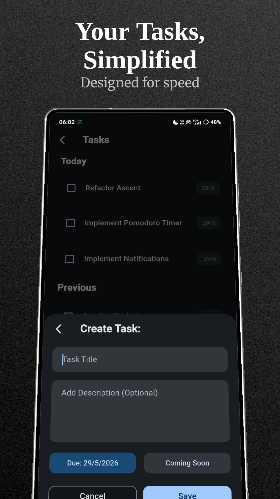
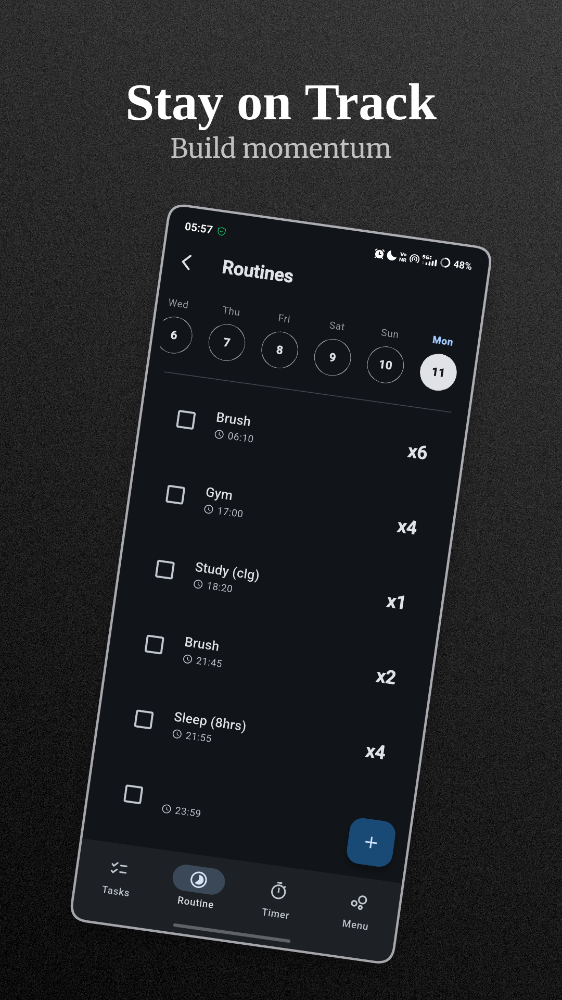
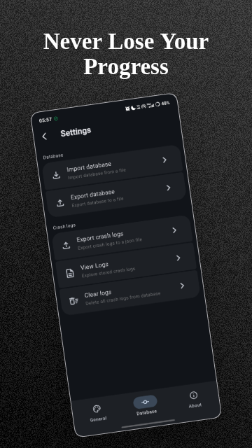

# Ascent

A blazing-fast Flutter mobile app for managing tasks, routines, and focus sessions with intuitive gestures and smooth performance.

Built for **speed** and **efficiency**. Perfect for productivity on the go!

### 📌 Why Ascent?

- **Gesture-driven** (swipe, hold, tap shortcuts)
- **Lightweight & optimized** (no lag, fast startup)
- **Clean UI** with dark/light mode

Try it now and boost your workflow! Contributions are welcome.

## Stats

    &nbsp;
    &nbsp;
    &nbsp;
    
     
    &nbsp;
    
     
    &nbsp;

## Features

✔ **To-Do List** – Quick-add, swipe gestures, smart sorting  
✔ **Pomodoro Timer** – Focus sessions with stats tracking  
✔ **Routines** – Lightweight & Simple  
✔ **Optimized UX** – Instant actions, minimal taps, silky animations

## Screenshots

<table>
    <tr>
        <td>  </td>
        <td>  </td>
        <td>  </td>
    </tr>
</table>
<!-- TODO: Add screenshots -->

## Contributing

Contributions are always welcome, whether it’s fixing bugs, improving documentation, or building new features. Help make Ascent faster, cleaner, and better for everyone.

> Please read [CONTRIBUTING.md](./CONTRIBUTING.md) before opening a Pull Request.

## Support

    &nbsp;
    &nbsp;
    

